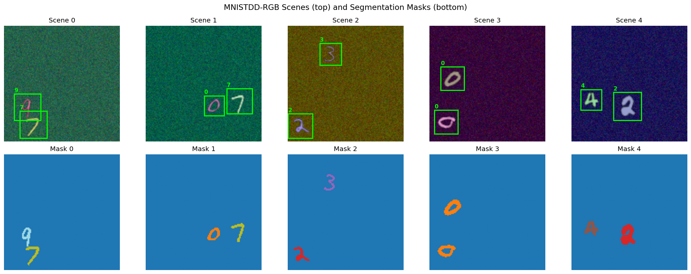
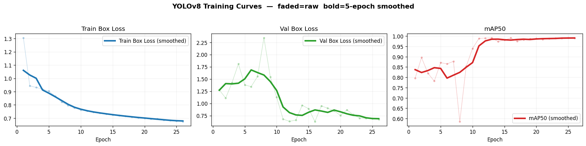
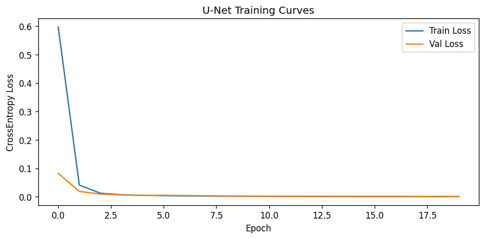
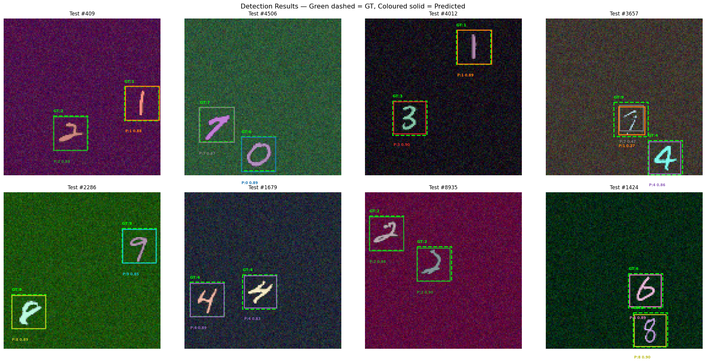
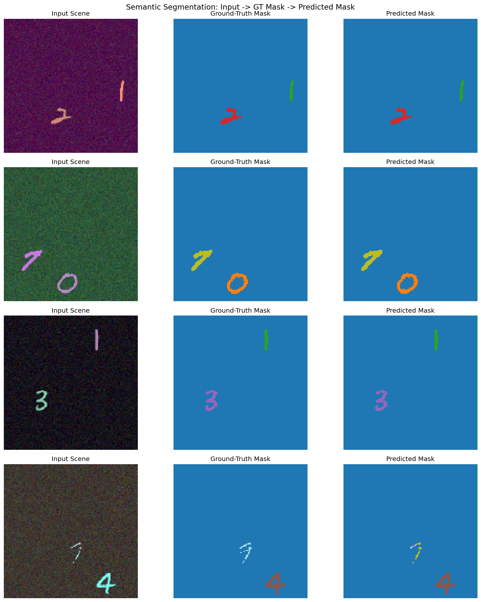
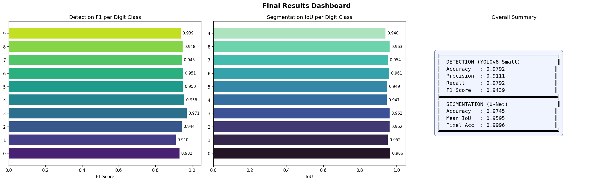
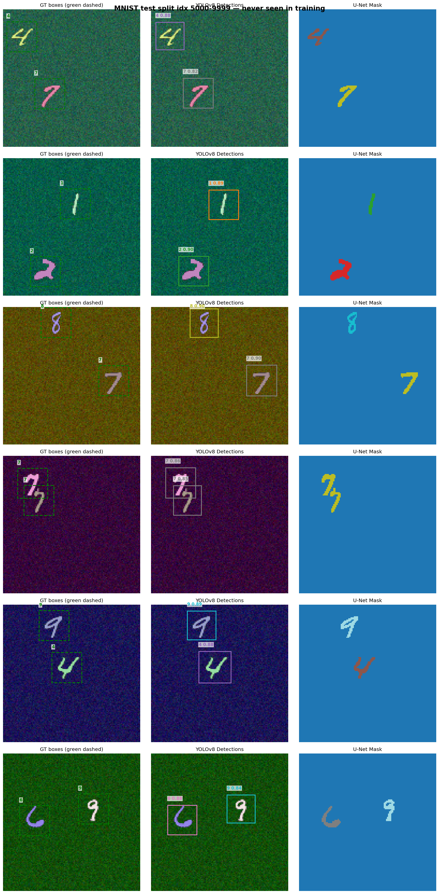

# Object Detection & Semantic Segmentation on MNISTDD-RGB

## What this notebook does

Takes raw MNIST handwritten digit images and builds a complete two-task computer vision pipeline:

1. **Detects** where each digit is in a scene — draws bounding boxes and labels them
2. **Segments** every pixel in the scene — colours each pixel by which digit it belongs to

---

## How it works — step by step

```
MNIST digits (60,000 images)
        ↓
Generate 100,000 synthetic scenes
Each scene: 2 digits placed randomly on a coloured noisy 128×128 canvas
        ↓
        ├── Train YOLOv8 Small  →  detects boxes + digit labels
        └── Train U-Net         →  labels every pixel by class
        ↓
Evaluate both models on 10,000 held-out test scenes
        ↓
Visualise results + export report
```

---

## Models

| Model | Task | Parameters |
|---|---|---|
| YOLOv8 Small | Object Detection | 11.2M |
| U-Net 4-level | Semantic Segmentation | ~7.8M |

---

## Results

| Model | Key Metric | Score |
|---|---|---|
| YOLOv8 Small | F1 Score | **94.39%** |
| YOLOv8 Small | Detection Accuracy | **97.92%** |
| U-Net | Mean IoU | **96.04%** |
| U-Net | Pixel Accuracy | **99.96%** |

---

## Notebook sections

| Section | What happens |
|---|---|
| 0 — Dependencies | Installs packages |
| 1 — Configuration | Sets all hyperparameters and paths |
| 2 — Data Generation | Downloads MNIST, generates 120,000 synthetic scenes |
| 3 — Visualisation | Shows sample scenes with ground truth boxes and masks |
| 4 — YOLO Training | Fine-tunes YOLOv8 Small, plots training curves |
| 5 — U-Net Training | Trains U-Net from scratch with early stopping |
| 6 — Segmentation Evaluation | Computes mIoU and pixel accuracy per class |
| 7 — Visualisations | Shows predicted boxes vs GT, predicted masks vs GT |
| 8 — Generalisation Test | Tests both models on completely unseen MNIST images |
| 9 — Final Report | Prints and saves full metrics report |
| 10 — Display Outputs | Shows all output images inline |
| 11 — Export | Packages everything for download |

---

## Libraries used

```
torch          — model training and inference
torchvision    — MNIST download, image transforms
ultralytics    — YOLOv8 training and inference
numpy          — array operations
Pillow         — image reading and saving
matplotlib     — visualisations
pandas         — reading YOLO training logs
tqdm           — progress bars
```

---

## How to run

**Kaggle (recommended):**
1. Set Accelerator to GPU T4 x2
2. Enable Internet
3. Kernel → Restart and Run All

**Colab:**
1. Runtime → Change Runtime Type → GPU
2. Runtime → Run All

**Local:**
```bash
pip install torch torchvision ultralytics matplotlib pillow pandas tqdm
jupyter notebook
```

---

## Output files produced

```
mnistdd_rgb_samples.png         sample generated scenes
yolo_training_curves.png        YOLO loss and mAP per epoch
unet_training_curves.png        U-Net loss per epoch
yolo_detection_results.png      predicted vs ground truth boxes
unet_segmentation_results.png   predicted vs ground truth masks
final_results_dashboard.png     all metrics in one figure
external_data_predictions.png   generalisation test results
official_predictions.png        predictions on official unseen scenes
results_report.txt              full metrics text report
yolov8s.pt                      YOLOv8s base/pretrained checkpoint
unet_best.pt                    trained U-Net weights
runs/digit_detector/weights/best.pt trained YOLO best checkpoint
runs/digit_detector/weights/last.pt trained YOLO last checkpoint
```

---

## Project file structure

```text
_output_/
├── README.md
├── results_report.txt
├── yolov8s.pt
├── unet_best.pt
├── mnistdd_rgb_samples.png
├── yolo_training_curves.png
├── unet_training_curves.png
├── yolo_detection_results.png
├── unet_segmentation_results.png
├── final_results_dashboard.png
├── external_data_predictions.png
├── official_predictions.png
├── data/
│   └── MNIST/
│       └── raw/
│           ├── train-images-idx3-ubyte(.gz)
│           ├── train-labels-idx1-ubyte(.gz)
│           ├── t10k-images-idx3-ubyte(.gz)
│           └── t10k-labels-idx1-ubyte(.gz)
├── digit_dataset/
│   ├── data.yaml
│   ├── images/
│   │   ├── train/  (100,000 files)
│   │   ├── val/    (10,000 files)
│   │   └── test/   (10,000 files)
│   ├── labels/
│   │   ├── train/  (100,000 files)
│   │   ├── val/    (10,000 files)
│   │   └── test/   (10,000 files)
│   └── masks/
│       ├── train/  (100,000 files)
│       ├── val/    (10,000 files)
│       └── test/   (10,000 files)
├── official_mnistdd_test/
│   ├── images/ (6 files)
│   ├── labels/ (6 files)
│   └── masks/  (6 files)
└── runs/
        └── digit_detector/
                ├── args.yaml
                ├── results.csv
                ├── results.png
                ├── BoxF1_curve.png
                ├── BoxP_curve.png
                ├── BoxR_curve.png
                ├── BoxPR_curve.png
                ├── confusion_matrix.png
                ├── confusion_matrix_normalized.png
                ├── train_batch*.jpg
                ├── val_batch*_labels.jpg
                ├── val_batch*_pred.jpg
                └── weights/
                        ├── best.pt
                        └── last.pt
```

---

## Results visualisations

### Generated sample scenes



### YOLO training curves



### U-Net training curves



### Detection output (Pred vs GT)



### Segmentation output (Pred vs GT)



### Final metrics dashboard



### Generalisation test visualisation


### Official unseen-scene predictions



---

## Final report snapshot (from results_report.txt)

| Task | Metric | Value |
|---|---|---|
| Object Detection (YOLOv8 Small) | Detection Accuracy | 0.9792 |
| Object Detection (YOLOv8 Small) | Precision | 0.9111 |
| Object Detection (YOLOv8 Small) | Recall | 0.9792 |
| Object Detection (YOLOv8 Small) | F1 Score | 0.9439 |
| Semantic Segmentation (U-Net) | Seg Accuracy (fg) | 0.9745 |
| Semantic Segmentation (U-Net) | Mean IoU | 0.9595 |
| Semantic Segmentation (U-Net) | Pixel Accuracy | 0.9996 |
